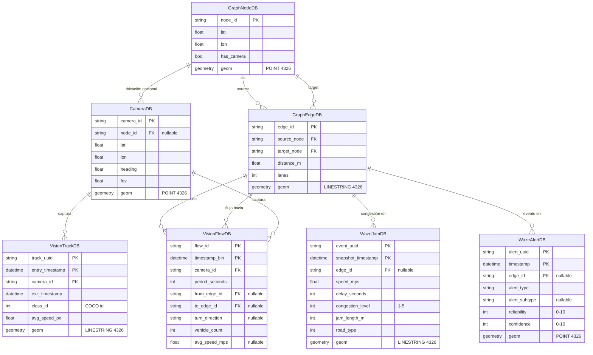

# Modelo de Datos — CerebroVial

> Referencia técnica del schema de base de datos. Para entender
> **por qué** está así y qué datos llena cada tabla, ver
> `DATA_MODEL_AUDIT.md`.

## Diagrama Entidad-Relación

## Tablas

### `graph_nodes` — Intersecciones

Una fila por **intersección física** del grafo vial. El sistema modela
la red vial como un grafo dirigido donde los nodos son cruces de calles.

| Columna | Tipo | Notas |
|---|---|---|
| `node_id` | string PK | ID legible (ej. `"larco_diagonal"`) |
| `lat`, `lon` | float | Coordenadas WGS84 |
| `has_camera` | bool | True si esta intersección tiene cámara YOLO |
| `geom` | POINT 4326 | Geometría espacial para queries PostGIS |

**Quién la llena:** seed inicial (`scripts/seed.py`, en E5). Estática
después.

**Quién la lee:** frontend (mapa de intersecciones), motor de control
(busca planes semafóricos), GRU (lookup de geografía).

### `graph_edges` — Calles (aristas)

Una fila por **calle dirigida** entre dos nodos. Una calle de doble
sentido se modela como **dos aristas**.

| Columna | Tipo | Notas |
|---|---|---|
| `edge_id` | string PK | |
| `source_node`, `target_node` | string FK → `graph_nodes` | Define la dirección |
| `distance_m` | float | Largo en metros |
| `lanes` | int | Número de carriles |
| `geom` | LINESTRING 4326 | Geometría de la calle |

**Quién la llena:** seed inicial. Estática después.

**Quién la lee:** Waze (los jams y alertas se asocian a un `edge_id`),
visión (los flujos turning conectan `from_edge_id` con `to_edge_id`),
control adaptativo, GRU.

### `cameras` — Cámaras de visión

Una fila por cámara desplegada en el sistema.

| Columna | Tipo | Notas |
|---|---|---|
| `camera_id` | string PK | |
| `node_id` | string FK → `graph_nodes`, nullable | Una cámara puede estar en una intersección o mid-block |
| `lat`, `lon` | float | Coordenadas WGS84 |
| `heading` | float | Ángulo de orientación 0-360° |
| `fov` | float | Field of view en grados |
| `geom` | POINT 4326 | |

**Quién la llena:** seed inicial. Para cámaras YouTube no nativas de
Miraflores, `heading`/`fov` son estimaciones manuales.

**Quién la lee:** módulo de visión (`edge_device`), frontend (mapa de
cámaras y stream).

### `waze_jams` — Snapshots de congestión de Waze

Serie temporal: cada snapshot es un punto de datos para un jam activo.
Mismo `event_uuid` puede tener múltiples snapshots a lo largo del
tiempo. Candidata a hypertable de TimescaleDB (E3).

| Columna | Tipo | Notas |
|---|---|---|
| `event_uuid` | string PK | ID del jam |
| `snapshot_timestamp` | datetime PK | Momento del snapshot |
| `edge_id` | string FK → `graph_edges`, nullable | Nullable porque jams fuera del grafo se descartan al asociar |
| `speed_mps` | float | Velocidad media |
| `delay_seconds` | int | Demora respecto a flujo libre |
| `congestion_level` | int | 1-5, **clasificación de Waze, ground truth para GRU** |
| `jam_length_m` | int | Metros de cola |
| `road_type` | int | Tipo de calle según Waze |
| `geom` | LINESTRING 4326 | Segmento congestionado |

**Quién la llena:** ingestor de Waze API (futuro, fuera de alcance
actual); para entrenamiento, dataset sintético generado en F2.

**Quién la lee:** GRU (input + ground truth), frontend (heatmap de
congestión), motor de control.

### `waze_alerts` — Alertas puntuales de Waze

Distintas a los jams. Eventos puntuales reportados por usuarios
(accidentes, peligros, policía, calle cerrada). Candidata a hypertable.

| Columna | Tipo | Notas |
|---|---|---|
| `alert_uuid` | string PK | |
| `timestamp` | datetime PK | |
| `edge_id` | string FK, nullable | |
| `alert_type` | string | `"ACCIDENT"`, `"HAZARD"`, `"ROAD_CLOSED"`, `"POLICE"`, `"JAM"` |
| `alert_subtype` | string nullable | Subcategoría más específica |
| `reliability` | int | 0-10, calculado por Waze |
| `confidence` | int | 0-10, calculado por Waze |
| `geom` | POINT 4326 | |

**Quién la llena:** ingestor de Waze API (futuro). Opcional para tesis.

**Quién la lee:** GRU como feature contextual (opcional), frontend.

### `vision_tracks` — Trayectorias individuales (modelada, no llenada)

Una fila por vehículo individual detectado y trackeado. Candidata a
hypertable.

| Columna | Tipo | Notas |
|---|---|---|
| `track_uuid` | string PK | |
| `entry_timestamp` | datetime PK | |
| `camera_id` | string FK → `cameras` | |
| `exit_timestamp` | datetime | |
| `class_id` | int | ID de clase COCO (2=car, 3=motorcycle, 5=bus, 7=truck) |
| `avg_speed_px` | float | **En píxeles/s, requiere calibración para m/s** |
| `geom` | LINESTRING 4326 | Trayectoria del vehículo |

**Quién la llena:** **nadie en alcance actual.** Modelada para futuro
trabajo de integración del pipeline de visión a BD.

**Quién la lee:** futuro. No usado por el GRU en alcance actual.

### `vision_flows` — Flujos turning por arista (modelada, no llenada)

Agregados de movimientos turning en intersecciones. Candidata a
hypertable.

| Columna | Tipo | Notas |
|---|---|---|
| `flow_id` | string PK | |
| `timestamp_bin` | datetime PK | Inicio de la ventana de agregación |
| `camera_id` | string FK | |
| `period_seconds` | int | Duración de la ventana |
| `from_edge_id` | string FK, nullable | Arista de origen del giro |
| `to_edge_id` | string FK, nullable | Arista de destino del giro |
| `turn_direction` | string nullable | `"left"`, `"right"`, `"straight"`, `"u-turn"` |
| `vehicle_count` | int | Cantidad de autos en este flujo |
| `avg_speed_mps` | float nullable | Velocidad media (calibrada) |

**Quién la llena:** **nadie en alcance actual.** Modelada para futuro
trabajo. El control adaptativo eventualmente usará esta información
para ajustar fases de semáforos.

**Quién la lee:** futuro.

### `vision_aggregates` — Persistencia BD de los datos del CSV (E18-E21)

> ⚠️ Tabla **a crear en E18**. No existe todavía.

Schema alineado con `csv_repository.py` para que la persistencia a
BD funcione sin refactor del pipeline de visión:

| Columna | Tipo | Notas |
|---|---|---|
| `id` | uuid PK | |
| `timestamp` | datetime, indexed | |
| `camera_id` | string FK → `cameras` | |
| `street_monitored` | string | Free-form, no FK al grafo |
| `car_count`, `bus_count`, `truck_count`, `motorcycle_count` | int | Conteo por tipo |
| `total_vehicles` | int | |
| `occupancy_rate` | float | |
| `flow_rate_per_min` | float | |
| `avg_speed` | float nullable | Sin unidad explícita en CSV; documentar |
| `avg_density` | float | |
| `zone_id` | string | |
| `duration_seconds` | float | Duración de la ventana de agregación |

**Quién la llena:** `PostgresAggregateRepository` (a implementar en
E19) recibe los mismos `TrafficData` que hoy van a CSV.

**Quién la lee:** dashboard del frontend (KPIs de visión por cámara),
demos de defensa.

## Hypertables (TimescaleDB)

En E3 se convierten las siguientes tablas en hypertables (chunk
time-based):

- `waze_jams` — partition por `snapshot_timestamp`
- `waze_alerts` — partition por `timestamp`
- `vision_tracks` — partition por `entry_timestamp` (aunque vacía hoy)
- `vision_flows` — partition por `timestamp_bin` (aunque vacía hoy)
- `vision_aggregates` — partition por `timestamp` (cuando se cree, E18+)

`chunk_time_interval`: a definir en E3. Default de TimescaleDB
(7 días) probablemente sirve. Para datasets sintéticos chicos se
puede ajustar a 1 día para tener más granularidad de chunks.

## Índices espaciales (PostGIS)

Todos los campos `geom` tienen índice GIST automáticamente (vía
`Geometry()` de GeoAlchemy2). Esto permite queries espaciales
eficientes:

- "intersecciones dentro de 500m" — `ST_DWithin`
- "jams que cruzan esta zona" — `ST_Intersects`
- "asignar cámara a la intersección más cercana" — `ST_Distance`

## Tablas internas de PostGIS

PostgreSQL con PostGIS instalado tiene tablas internas
(`spatial_ref_sys`, `layer`, `topology`) que NO son del modelo de
CerebroVial. La configuración de Alembic en `env.py` excluye estas
tablas del autogenerate vía `include_object` callback (configurado
en E2).